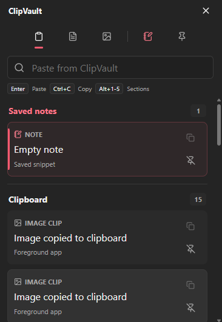

# ClipVault

ClipVault is a modern lightweight Windows clipboard manager with encrypted local history, saved note snippets, OCR, smart preview actions, and a fast quick-paste popup.

It captures text and images, gives you a fast `Ctrl+Shift+V` quick paste popup, lets you save reusable notes/snippets, and keeps all content local.



## Features

- Text and image clipboard history.
- Searchable timeline with source metadata, tags, pins, and SQLite FTS indexing.
- Windows-style quick paste popup with draggable dark UI, keyboard navigation, fuzzy search, and grouped clipboard/notes results.
- Default global shortcut: `Ctrl+Shift+V`.
- Notes as saved snippets, stored in the same encrypted item system as clipboard entries.
- Favorite note templates: meeting note, todo, code snippet, prompt, and email reply.
- On-demand local OCR for copied screenshots and image clips using Windows native OCR APIs.
- Smart preview actions for detected content:
  - open URL
  - copy domain
  - format JSON
  - beautify code
  - extract emails
  - open Windows file path
- Privacy controls for capture pause, excluded apps/window titles, sensitive-value suppression, and retention.
- Encrypted import/export for settings, notes, and pinned clips.
- Windows GUI release build, so launching the app does not open a console window.

## Tech Stack

- Tauri 2
- React 18
- TypeScript
- Vite
- Rust
- SQLite with SQLCipher
- Windows DPAPI for protecting local encryption material and backup payloads
- Windows clipboard, global shortcut, paste simulation, and OCR integrations

## Requirements

- Windows 10/11.
- Node.js 20+.
- npm 10+.
- Rust and Cargo through rustup.
- Microsoft C++ Build Tools.
- Microsoft Edge WebView2 runtime.
- Strawberry Perl, needed by the vendored native crypto/SQLCipher build on this machine.

## Install

```powershell
npm install
```

This project currently includes a `pnpm-lock.yaml` from earlier setup, but the active scripts and latest verification use npm.

## Development

Run the frontend only:

```powershell
npm run dev
```

Run the full Tauri desktop app:

```powershell
npm run tauri -- dev
```

## Build

```powershell
npm run build
npm run tauri -- build
```

Release outputs are generated under:

- `src-tauri/target/release/clipvault.exe`
- `src-tauri/target/release/bundle/nsis/ClipVault_0.1.0_x64-setup.exe`
- `src-tauri/target/release/bundle/msi/ClipVault_0.1.0_x64_en-US.msi`

## Verification

Use these before pushing:

```powershell
npm run build
cargo test --manifest-path src-tauri/Cargo.toml
cargo fmt --manifest-path src-tauri/Cargo.toml --check
cargo clippy --manifest-path src-tauri/Cargo.toml -- -D warnings
npm run tauri -- build
```

If Cargo is not on PATH in PowerShell, prepend the local toolchain paths first:

```powershell
$env:Path = "$env:USERPROFILE\.cargo\bin;C:\Strawberry\perl\bin;C:\Strawberry\c\bin;C:\Strawberry\perl\site\bin;$env:Path"
```

## Current Status

The app is runnable and packaged for Windows. The latest local verification completed successfully for:

- `npm run build`
- `cargo test --manifest-path src-tauri\Cargo.toml`
- `npm run tauri -- build`

## Roadmap

- Clipboard restore after paste for more content formats.
- Tray menu polish.
- Export/import UX refinements and cross-machine backup options.
- Optional Tesseract OCR fallback.
- End-to-end encrypted PC/Android sync, keeping Android clipboard platform limits in mind.
